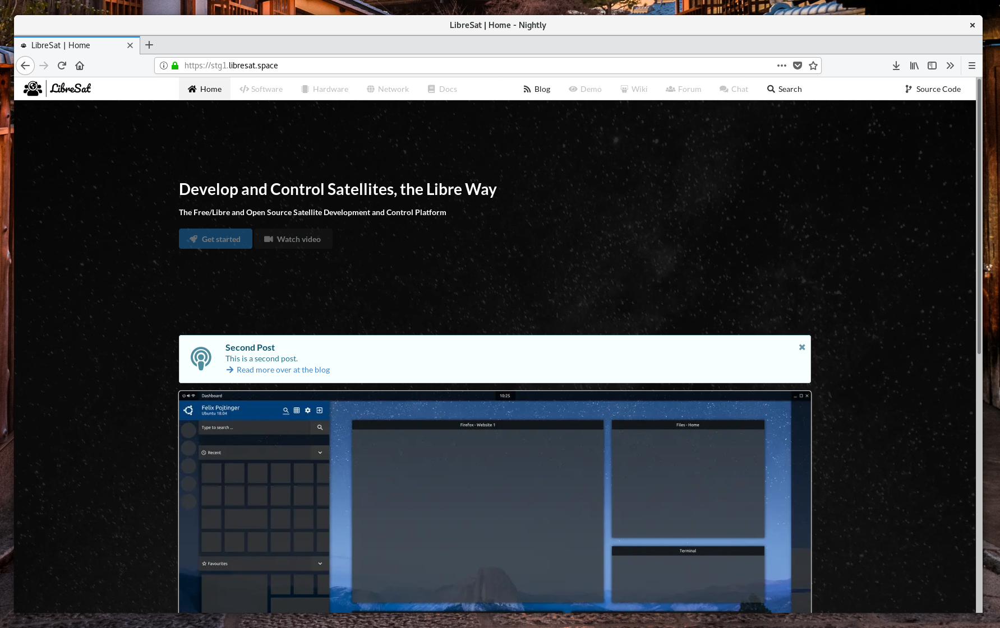
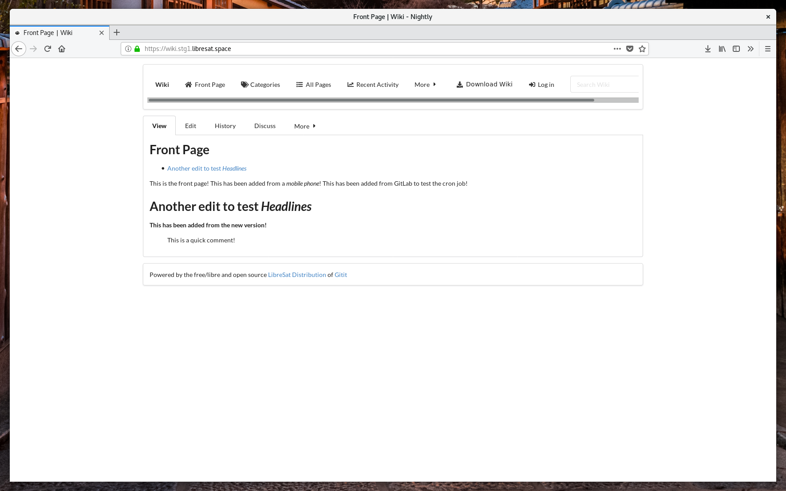
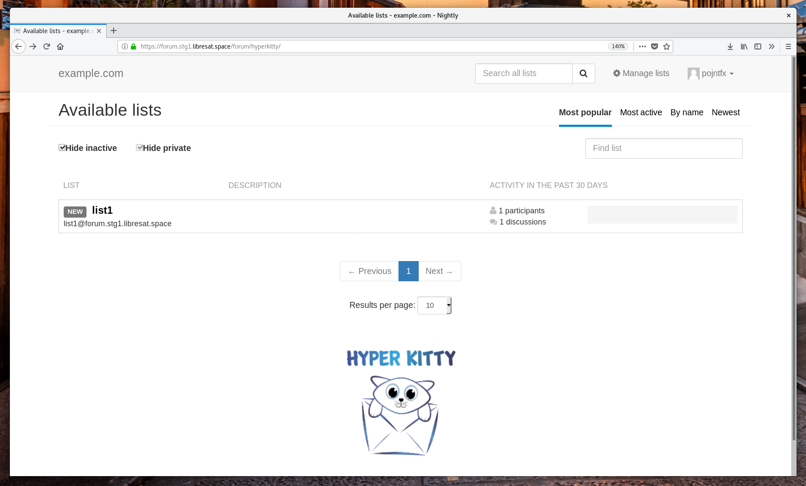
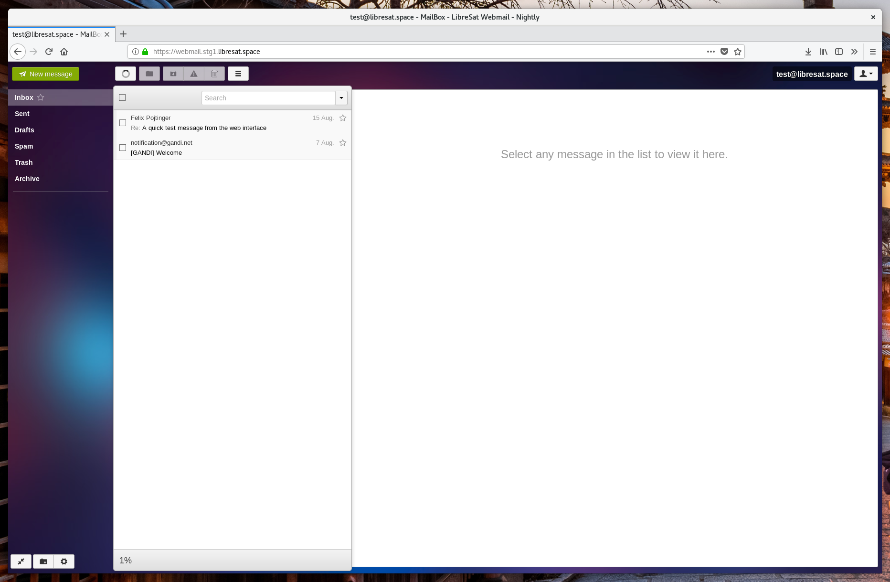

# LibreSat

The Free/Libre and Open Source Satellite Development and Control Platform, since 2014.

[](https://libresat.space)
[](https://demo.libresat.space)
[](https://wiki.libresat.space)
[](https://forum.libresat.space/forum)
[](https://chat.libresat.space)


[](https://mastodon.cloud/@libresat)
[](https://twitter.com/libresat)
[](https://www.reddit.com/r/libresat/)
[](https://www.instagram.com/libresat/)

[](https://gitlab.com/libresat)
[](https://github.com/libresat)
[](https://www.npmjs.com/~libresat)

[](https://www.gnu.org/licenses/agpl-3.0.en.html)
[](https://creativecommons.org/licenses/by-sa/4.0/)

---

## Usage

```bash
# Install dependencies
npm install
# Start development version of inidividual package
npm run dev -- --scope @libresat/identity-backend
# Start development version of and debugger for inidividual package
npm run dev:debug -- --scope @libresat/identity-backend
# Now, connect using the "Attach" configuration in the VSCode Debugger (press "F5")!
# Start development versions of all packages
npm run dev
```

## Deployment

```bash
# Build production version of inidividual package
npm run build -- --scope @libresat/identity-backend
# Build production versions of all packages
npm run build
# Start production version of inidividual package
npm run start -- --scope @libresat/identity-backend
# Start production versions of all packages
npm run start
# Publish packages to npm
npm run publish
```

## Screenshots









## License

These licenses do, if not otherwise specified, apply to all packages in this repository.

### Code

[](https://www.gnu.org/licenses/agpl.html)

LibreSat
Copyright (C) 2018 Felicitas Pojtinger

SPDX-License-Identifier: AGPL-3.0

This program is free software: you can redistribute it and/or modify it under the terms of the GNU Affero General Public License as published by the Free Software Foundation, either version 3 of the License, or (at your option) any later version.

This program is distributed in the hope that it will be useful, but WITHOUT ANY WARRANTY; without even the implied warranty of MERCHANTABILITY or FITNESS FOR A PARTICULAR PURPOSE. See the GNU Affero General Public License for more details.

You should have received a copy of the GNU Affero General Public License along with this program. If not, see [https://www.gnu.org/licenses/](https://www.gnu.org/licenses/).

### Media

[](https://creativecommons.org/licenses/by-sa/4.0/)

Media of LibreSat
Copyright (C) 2018 Felicitas Pojtinger

SPDX-License-Identifier: CC-BY-SA-4.0

This work is licensed under a [Creative Commons Attribution 4.0 International License](https://creativecommons.org/licenses/by-sa/4.0/).
