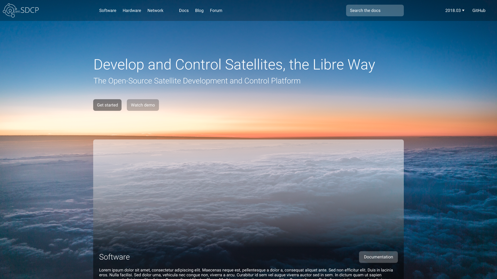
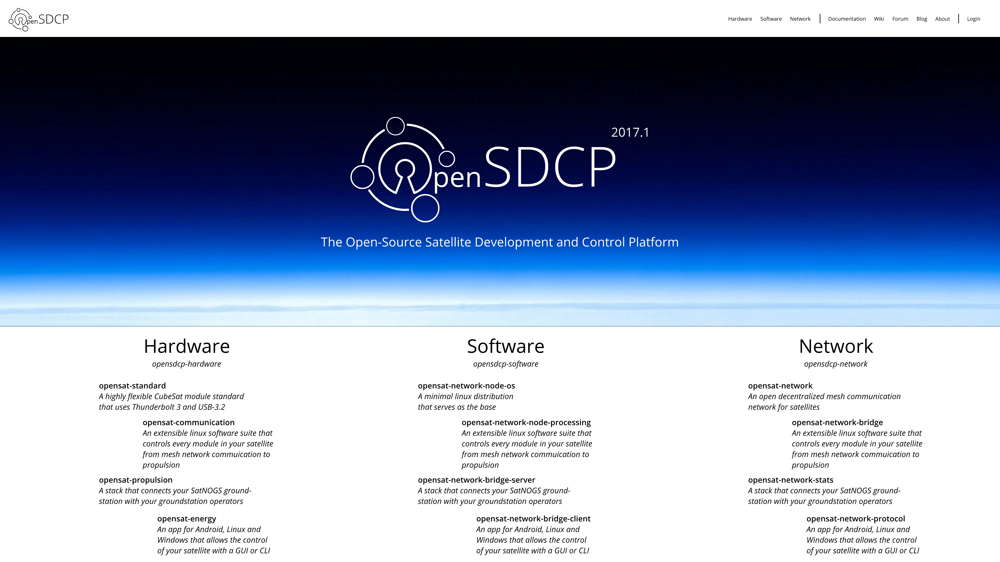

# OpenSDCP Design

All design files and mockups for the OpenSDCP repos.

## Examples

## License

OpenSDCP Design Mockup Media (C) 2018 Felicitas Pojtinger

All the media files (images, videos etc.) are licensed Creative Commons Attribution 4.0 (CC-BY-4.0).

OpenSDCP Design Mockup Code (C) 2018 Felicitas Pojtinger

This program is free software: you can redistribute it and/or modify
it under the terms of the GNU General Public License as published by
the Free Software Foundation, either version 3 of the License, or
(at your option) any later version.

This program is distributed in the hope that it will be useful,
but WITHOUT ANY WARRANTY; without even the implied warranty of
MERCHANTABILITY or FITNESS FOR A PARTICULAR PURPOSE. See the
GNU General Public License for more details.

You should have received a copy of the GNU General Public License
along with this program. If not, see <http://www.gnu.org/licenses/>.
