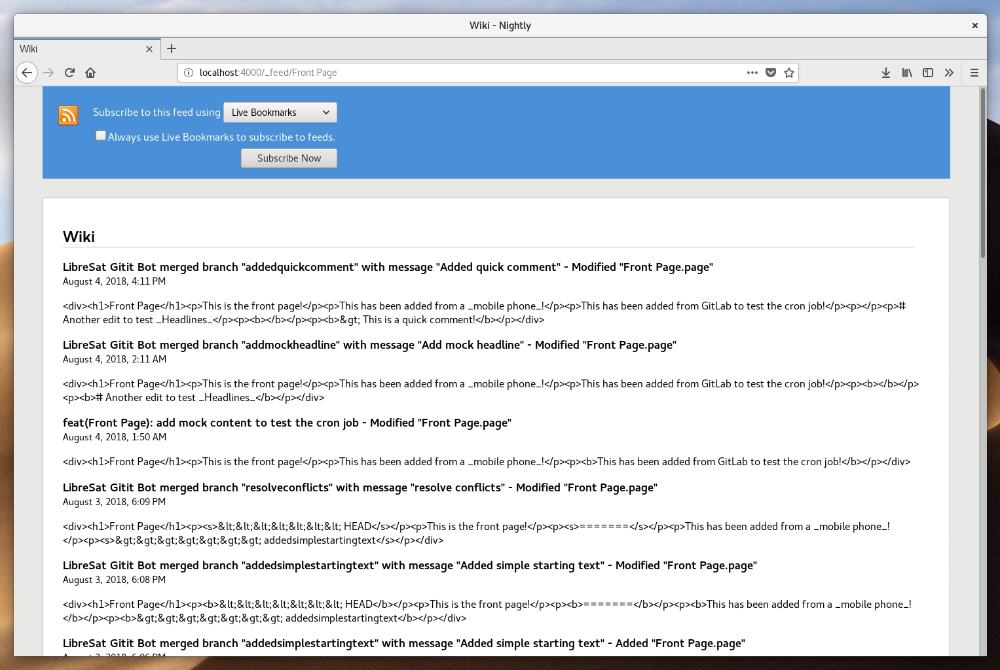
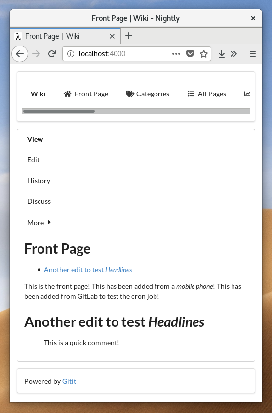

# LibreSat Wiki

[Gitit](https://github.com/jgm/gitit) distribution for the [LibreSat](http://libresat.space/) project. It uses [Semantic UI](https://semantic-ui.com/) as it's UI framework, [Git](https://git-scm.com/) as it's VCS and a remote git host (such as [GitLab](https://gitlab.com/)) as it's data backend. It also includes a SSH server to access the git repo locally.

> Consider reading the [infrastructure overview](https://github.com/opensdcp/opensdcp-infrastructure#overview) before continuing.

## Demo

Visit [wiki.libresat.space](https://wiki.libresat.space) and take a look at our instance.

## Usage

### Preparation

```bash
# Install dependencies (Fedora/CentOS/RHEL)
sudo dnf install npm docker docker-compose

# Install dependencies (Debian/Mint/Elementary/Ubuntu)
sudo apt install npm docker.io docker-compose
```

### Configuraton

#### Set SSH Key

```bash
# Reads your public SSH key and overwrites the contents of assets/id_rsa.pub with it
echo $(<~/.ssh/id_rsa.pub) > src/assets/id_rsa.pub
```

#### Create Bot Account and Remote Git Repository

1.  Create account on [GitLab](https://gitlab.com) or other host
2.  Create git repo on host and give the bot account access to it (on GitLab, the "Maintainer" role permission is the right one)
3.  Add a file called "LICENSE.md" with a free (as in freedom) license in it (see [https://choosealicense.com/non-software/](https://choosealicense.com/non-software/)) to the repo. The repo must not be empty.
4.  Open up the SSH keys settings page of the bot account (on GitLab, that's [https://gitlab.com/profile/keys](https://gitlab.com/profile/keys)). We'll have to paste in the public SSH key of the bot later on

#### Link to the Remote Git Repository

> Use your own data here, of course.

```bash
echo "git@gitlab.com:pojntfx/git-wikidata-test.git" \
> src/assets/templates/sshgitlink.st
echo "https://gitlab.com/pojntfx/git-wikidata-test" \
> src/assets/templates/httpsgitlink.st
```

Consider editing `src/gitit.conf` for many more configuration options.

#### Set Env Variables

The following env variables are available:

| Variable Name          | Example Value                                | Description                                                                                     |
| ---------------------- | -------------------------------------------- | ----------------------------------------------------------------------------------------------- |
| GIT_BOT_EMAIL          | gitit-bot@libresat.space                     | Email to use for the merge bot                                                                  |
| GIT_BOT_NAME           | LibreSat Gitit Bot                           | Name to use for the merge bot                                                                   |
| GIT_REMOTE             | git@gitlab.com:pojntfx/git-wikidata-test.git | Remote git repo to store the data in (use SSH, not HTTPS)                                       |  |
| EXTERNAL_SMTP_DOMAIN   | mail.gandi.net                               | SMTP server's domain to send "reset password" mails to with                                     |
| EXTERNAL_SMTP_USERNAME | noreply@libresat.space                       | Account name of the account on the SMTP server you want to send the "reset password" mails with |
| EXTERNAL_SMTP_PASSWORD | 249j8923490sdaSf8234ns                       | Password of the account on the SMTP server you want to send the "reset password" mails with     |

They are being passed into the container at build time with the `--build-arg` flag.

### Building

#### Compile Assets

```bash
# Install dependencies
npm install
# Compile CSS and JS
npm run build-semantic
```

#### Build Container

During the container's build, the public SSH key of the container will be logged after a message like this:

```sh
>>> USER ACTION REQUIRED: CREATE A GITLAB/GITHUB USER, GRANT ACCESS TO WIKIDATA REPO, ADD FOLLOWING PUBLIC SSH KEY TO PROFILE <<<
```

It will look like this:

```sh
ssh-rsa AAAAB3NzaC1yc2EAAAADAQABAAABAQDKIXi4sTx2(...)0HLDtR2nuSSPGr root@f639faccb8ce
```

Copy-and-paste this public SSH key into SSH keys settings page of the bot account (see [Create Bot Account and Remote Git Repository](#Create%20Bot%20Account%20and%20Remote%20Git%20Repository)). If you don't do so and just let the build run, cloning the remote git repo will fail. If this happens, just copy-and-paste the key and re-run the command below (the key will be the same). You'll only have to do this once - all further instances have the same private key so they can use this public key.

```bash
# Build the container
docker build \
--build-arg GIT_BOT_EMAIL="gitit-bot@libresat.space" \
--build-arg GIT_BOT_NAME="LibreSat Gitit Bot" \
--build-arg GIT_REMOTE="git@gitlab.com:pojntfx/git-wikidata-test.git" \
--build-arg EXTERNAL_SMTP_DOMAIN="mail.gandi.net" \
--build-arg EXTERNAL_SMTP_USERNAME="noreply@libresat.space" \
--build-arg EXTERNAL_SMTP_PASSWORD="249j8923490sdaSf8234ns" \
src/ \
-t libresat-wiki
```

### Startup

```bash
# Serve production version on http://localhost:4000 with the SSH server on http://localhost:4001
docker-compose -f src/libresat-wiki-prod.yml up -d
```

You may test if it is working by running the following:

```bash
# Test if web interface works
curl localhost:4000
# Test access to internal git repo
git clone ssh://git@localhost:4001/gitit/wikidata
```

### Setup

> No further setup is required.

## Screenshots







## Documentation

Visit the [official Gitit documentation](https://github.com/jgm/gitit) to learn more about Gitit.

## Deployment

### Kubernetes

> TODO: Add Kubernetes deployment

### Docker Swarm

```bash
# Serve production version on http://yourip:4000 with the SSH server on http://yourip:4001
docker stack deploy -c src/libresat-wiki-prod.yml libresat-wiki
```

## License

### Source Code

<a rel="license" href="https://www.gnu.org/licenses/agpl.html">
  
</a>

LibreSat Wiki
Copyright (C) 2018 Felix Pojtinger

This program is free software: you can redistribute it and/or modify it under the terms of the GNU Affero General Public License as published by the Free Software Foundation, either version 3 of the License, or (at your option) any later version.

This program is distributed in the hope that it will be useful, but WITHOUT ANY WARRANTY; without even the implied warranty of MERCHANTABILITY or FITNESS FOR A PARTICULAR PURPOSE. See the GNU Affero General Public License for more details.

You should have received a copy of the GNU Affero General Public License along with this program. If not, see <https://www.gnu.org/licenses/>.

### Media

Media of LibreSat Wiki (C) 2018 Felix Pojtinger

<a rel="license" href="http://creativecommons.org/licenses/by/4.0/">
  
</a>

This work is licensed under a <a rel="license" href="http://creativecommons.org/licenses/by/4.0/">Creative Commons Attribution 4.0 International License</a>.
