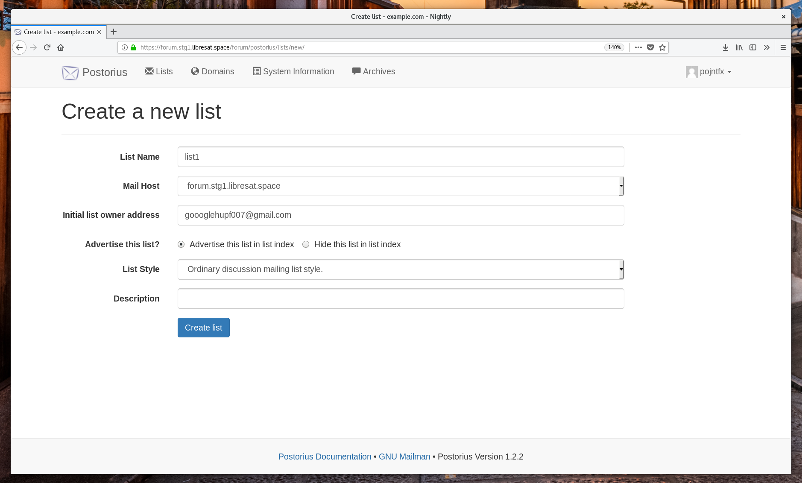

# LibreSat Forum


The [LibreSat](https://libresat.space/) distribution of [GNU Mailman](http://www.list.org/).

[](https://forum.libresat.space/forum)
[](https://libresat.space)

## Usage

See [src/chart/templates/NOTES.txt](src/chart/templates/NOTES.txt) for setup instructions.

You can use [custom templates for Mailman](http://docs.mailman3.org/en/latest/config-core.html#configure-templates) by putting them into the [src/assets/mailman-core/templates](src/assets/mailman-core/templates) folder.

### With build script

```bash
# Make it executable
chmod +x mailman-suite/build-run-test.sh
# Run it
mailman-suite/build-run-test.sh
```

### Without build script

```bash
# Create volume for mailman-core's data
docker volume create mailman-core-data
# Create volume for mailman-web's data
docker volume create mailman-web-data
# Build image
docker build src -t pojntfx/libresat-forum
# Run image
docker run \
-d \
-h mail@domain.tld \
-p 8000:80 \
-v mailman-core-data:/var/tmp/mailman/data \
-v mailman-web-data:/opt/mailman-web/databases \
pojntfx/libresat-forum
```

### Debugging

```bash
# Get docker container id
docker ps | grep libresat-forum
# Test postfix by sending a mail (THIS WILL NOT WORK IF YOU HAVE NOT YET SET UP DOMAIN AS DESCRIBED IN NOTES.txt!)
docker exec DOCKER_CONTAINER_ID bash -c 'echo "Test Message Body" | mail -s "Test Message Subject" user@domain.tld'
# Test mailman-core REST api (should return "401 Unauthorized")
docker exec DOCKER_CONTAINER_ID bash -c "apt install -y curl && sleep 15 && curl http://localhost:8001/3.1 && apt remove curl"
# Look at mailman-core's logs
docker exec DOCKER_CONTAINER_ID bash -c "tail -f /var/tmp/mailman/logs/mailman.log" # When you sign up and verify using hyperkitty/postorius, the REST actions will show up here
# Look at mailman-web's logs
docker exec DOCKER_CONTAINER_ID bash -c "tail -f /var/log/apache2/error.log" # mailman-web's wsgi server logs here
# Use interactive bash inside the container
docker exec -it DOCKER_CONTAINER_ID bash
```

## Deployment

Edit [src/chart/values.yaml](src/chart/values.yaml) according to your needs.

```bash
# Build image
docker build src/ -t pojntfx/libresat-forum
# Deploy to Kubernetes
helm install --values src/chart/values.yaml --namespace forum src/chart
```

## Screenshots




