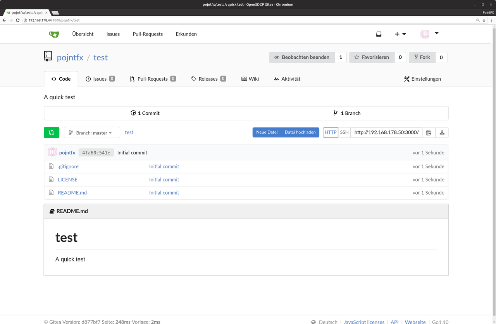

# OpenSDCP Git

Gitea service configuration for the OpenSDCP project.

> Consider reading the [infrastructure overview](https://github.com/opensdcp/opensdcp-infrastructure#overview) before continuing.

## Demo

Visit [git.opensdcp.org](https://git.opensdcp.org/) and take a look at our instance.

## Usage

### Preparation

```bash
# Install dependencies (Ubuntu and Debian)
sudo apt install docker.io docker-compose
# Set password and username of the database
echo \
"POSTGRES_USER=YOUR_USERNAME_HERE
POSTGRES_PASSWORD=YOUR_PASSWORD_HERE"\
>> .env
# Read in the env variables
source .env
```

### Startup

```bash
# Serve development version on http://YOUR_IP:2100
docker-compose -f opensdcp-git-dev.yml up
# ALTERNATIVE: Serve production version on http://YOUR_IP:2000
docker-compose -f opensdcp-git-prod.yml up
```

### Setup

Visit `http://YOUR_IP:YOUR_PORT_FROM_ABOVE` and continue with the installation. Select the following:

| Key               | Value                                           |
| ----------------- | ----------------------------------------------- |
| Database type     | `PostgreSQL`                                    |
| Database host     | `db:5432`                                       |
| Database user     | `YOUR_USERNAME_HERE`                            |
| Database password | `YOUR_PASSWORD_HERE`                            |
| Application name  | `My OpenSDCP Gitea`                             |
| SSH server domain | `YOUR_IP`                                       |
| SSH server port   | `YOUR_PORT_FROM_ABOVE_WITH_1_INSTEAD_OF_LAST_0` |
| HTTP port         | `YOUR_PORT_FROM_ABOVE`                          |
| Application URL   | `http://YOUR_IP:YOUR_PORT_FROM_ABOVE`           |

Use the defaults for the rest. You may change YOUR_IP (which will be in the clone URLs) later by editing the Gitea config files.

Now check the terminal output, look for whether the PostgreSQL database server has started up (it might take some time) and start the installation!

After it has completed, register. The first user will be the admin. Then sign in to test whether everything works!

> If you chose the development version, all the data will be saved in `./opensdcp-git-web-data-dev/` and `./opensdcp-git-db-data-dev/` in case you want to create backups. If you used the production version, it will be saved in the `opensdcp-git-web-data` and `opensdcp-git-db-data` docker volumes.

## Screenshots



## Documentation

Visit the [official Gitea documentation](https://docs.gitea.io/) to learn more about Gitea.

## Deployment

### Kubernetes

```bash
# Set env variables
kubectl create configmap opensdcp-git-config \
--from-literal=postgres_user=YOUR_USERNAME_HERE \
--from-literal=postgres_password=YOUR_PASSWORD_HERE

# Create the db's persistent volume
kubectl create -f persistentvolumes/db.yml
# Create the db's persistent volume claim
kubectl create -f persistentvolumeclaims/db.yml
# Create the db's deployment
kubectl create -f deployments/db.yml
# Create the db's service
kubectl create -f services/db.yml

# Create the web server's persistent volume
kubectl create -f persistentvolumes/web.yml
# Create the web server's persistent volume claim
kubectl create -f persistentvolumeclaims/web.yml
# Create the web server's deployment
kubectl create -f deployments/web.yml
# Create the web server's service
kubectl create -f services/web.yml

# Now open up the web server's endpoint and install it
# (using the instructions from "Setup", but with `opensdcp-git-db` as the database host and
# `opensdcp-git-web` as the ssh server domain)
```

### Docker Swarm

> Use the Portainer GUI (opensdcp-swarm-manager) to set the env variables by creating the stack there or hard-code them into the opensdcp-git-prod.yml file. They are NOT being read in by docker stack deploy, which will result in the `The database settings are invalid: pq: role "YOUR_USERNAME_HERE" does not exist` error upon setup.

```bash
# Deploy production version to your docker swarm on http://YOUR_IP:2000
docker stack deploy -c opensdcp-git-prod.yml opensdcp-git
```

## License

OpenSDCP Gitea Service Configuration (C) 2018 Felix Pojtinger

This program is free software: you can redistribute it and/or modify
it under the terms of the GNU General Public License as published by
the Free Software Foundation, either version 3 of the License, or
(at your option) any later version.

This program is distributed in the hope that it will be useful,
but WITHOUT ANY WARRANTY; without even the implied warranty of
MERCHANTABILITY or FITNESS FOR A PARTICULAR PURPOSE. See the
GNU General Public License for more details.

You should have received a copy of the GNU General Public License
along with this program. If not, see <http://www.gnu.org/licenses/>.
