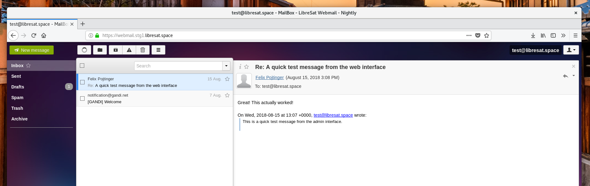

# LibreSat Mail



The [LibreSat](https://libresat.space/) distribution of [Rainloop](https://www.rainloop.net/).

[](https://webmail.libresat.space)
[](https://libresat.space)

## Deployment

Edit [src/chart/values.yaml](src/chart/values.yaml) according to your needs.

```bash
# Deploy to Kubernetes
helm install --values src/chart/values.yaml --namespace forum src/chart
```

## Screenshots


