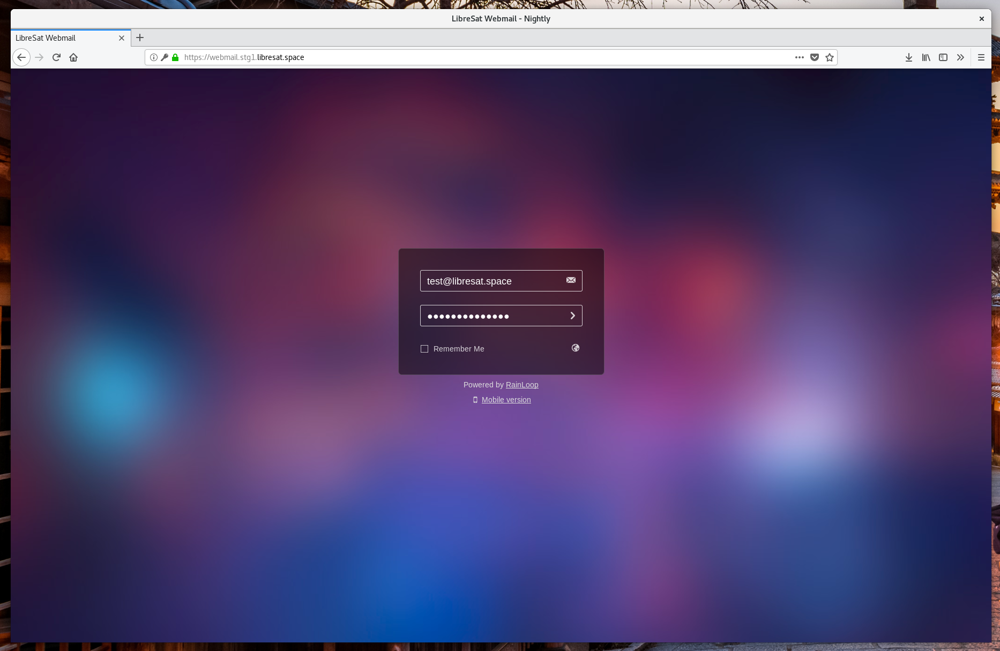
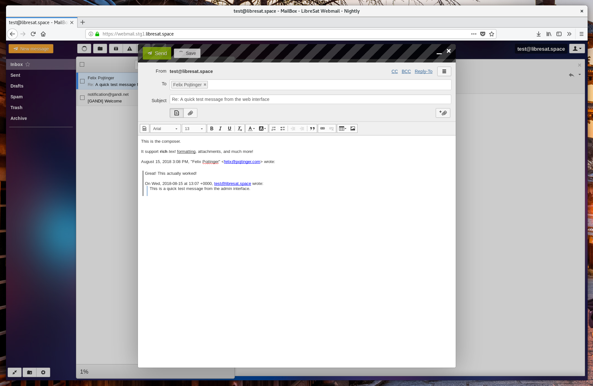
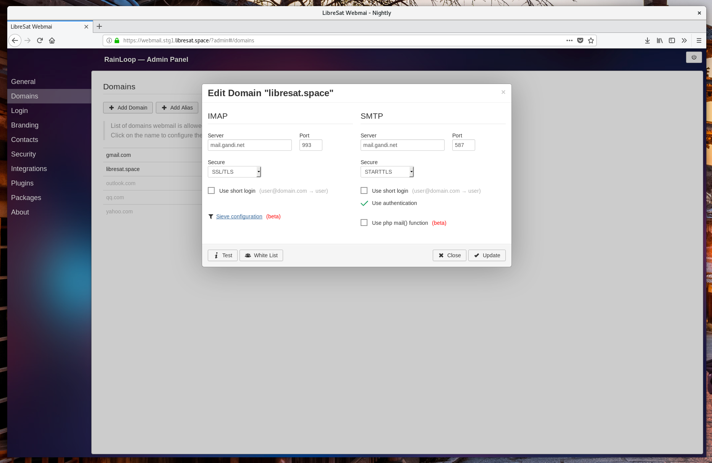
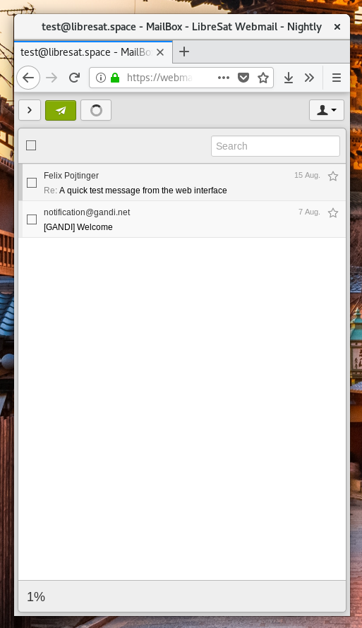

# LibreSat Mail

The [LibreSat](https://libresat.space/) Distribution of [Rainloop](https://www.rainloop.net/).

> The `mail` package is part of the `libresat` monorepository. Consider reading the [LibreSat cluster overview](https://libresat.space/docs/cluster.html) before continuing.

## Usage

### Configuration

Open up [src/rainloop/values.yaml](src/rainloop/values.yaml) and adjust it to your needs.

| Key    | Default Value               | Description                                        |
| ------ | --------------------------- | -------------------------------------------------- |
| domain | webmail.stg1.libresat.space | The FQDN that you wish Rainloop to be reachable on |

### Installation

```bash
# Install on Kubernetes cluster
helm install src/rainloop
```

### Setup

Check out the terminal output from the [Installation](#Installation) command for further setup instructions.

## Demos

Visit [webmail.stg1.libresat.space](https://webmail.stg1.libresat.space) and take a look at our staging instance.

## Screenshots










## Documentation

Visit [libresat.space/docs/services/mail](https://libresat.space/docs/services/mail.html) and take a look at the official documentation.

## License

### Source Code

[](https://www.gnu.org/licenses/agpl.html)

LibreSat Distribution of Rainloop
Copyright (C) 2018 Felix Pojtinger

This program is free software: you can redistribute it and/or modify it under the terms of the GNU Affero General Public License as published by the Free Software Foundation, either version 3 of the License, or (at your option) any later version.

This program is distributed in the hope that it will be useful, but WITHOUT ANY WARRANTY; without even the implied warranty of MERCHANTABILITY or FITNESS FOR A PARTICULAR PURPOSE. See the GNU Affero General Public License for more details.

You should have received a copy of the GNU Affero General Public License along with this program. If not, see [https://www.gnu.org/licenses/](https://www.gnu.org/licenses/).

### Media

[](https://creativecommons.org/licenses/by/4.0/)

Media of the LibreSat Distribution of Rainloop
Copyright (C) 2018 Felix Pojtinger

This work is licensed under a [Creative Commons Attribution 4.0 International License](https://creativecommons.org/licenses/by/4.0/)
