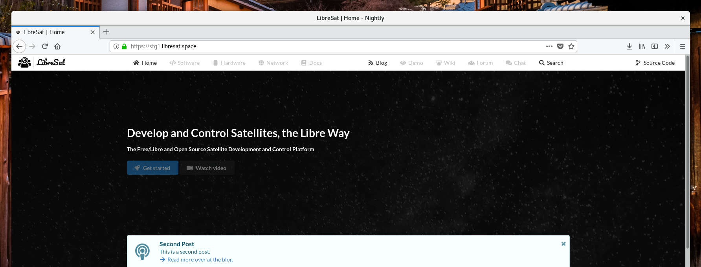
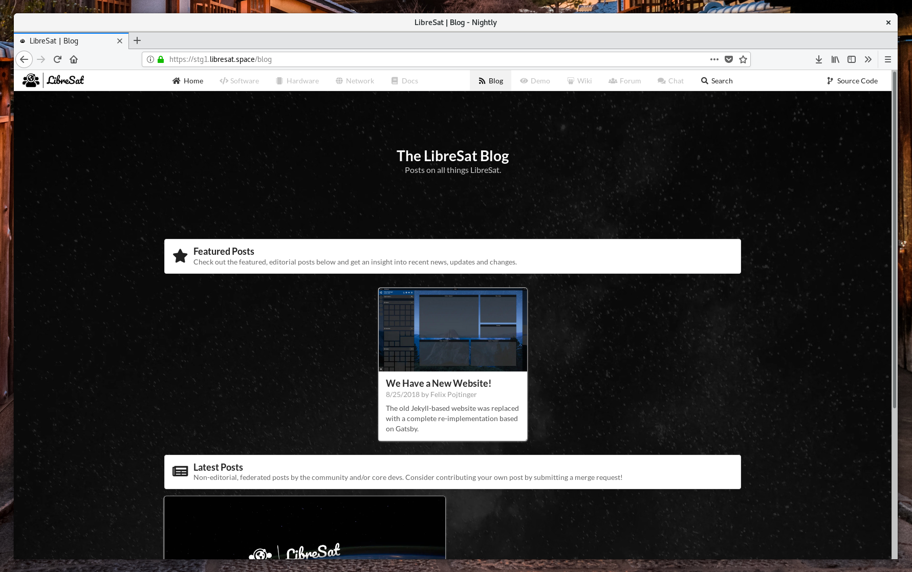
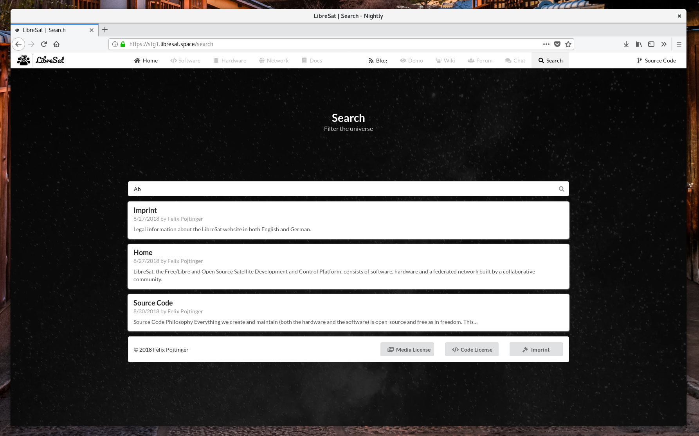
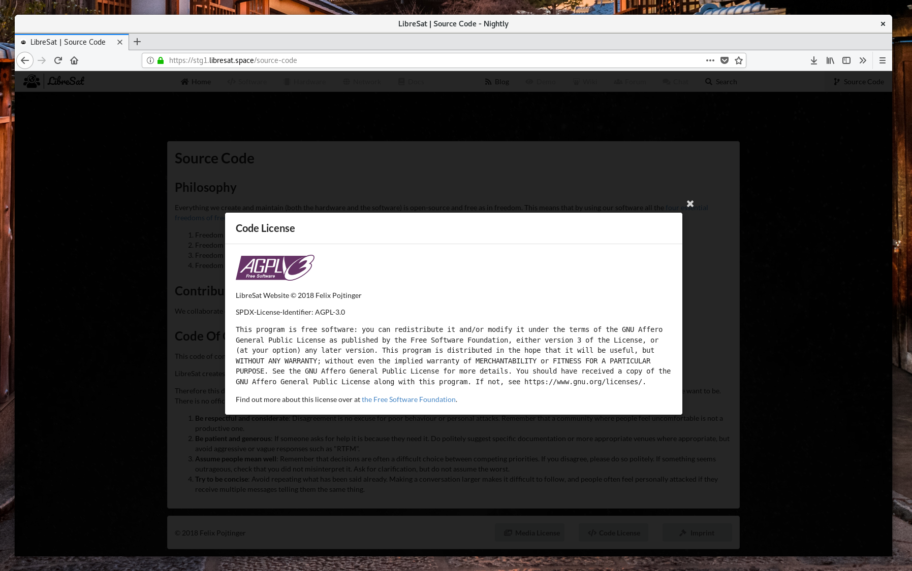

# LibreSat Site

The [LibreSat](https://libresat.space/) website.



[](https://libresat.space)
[](https://www.gnu.org/licenses/agpl-3.0.en.html)
[](https://creativecommons.org/licenses/by-sa/4.0/)
[](https://gitlab.com/libresat/libresat)
[](https://libresat.space/docs/infrastructure)

## Usage

```bash
# Install dependencies
npm install
# Build and serve development version on http://localhost:8000
npm run dev
# Build and serve production version on http://localhost:9000
npm run build
npm start
```

## Deployment

Edit [src/chart/values.yaml](src/chart/values.yaml) according to your needs.

```bash
# Build image
docker build . -t pojntfx/libresat-site
# Deploy to Kubernetes
helm install --values src/chart/values.yaml src/chart
```

## Screenshots







