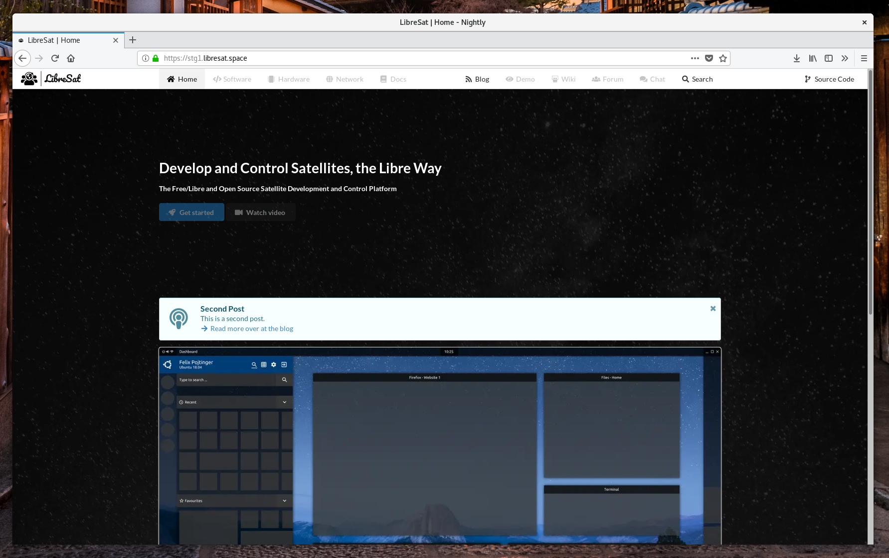

# LibreSat Website

The [LibreSat](https://libresat.space/) website.

> The `site` package is part of the `libresat` monorepository. Consider reading the [LibreSat cluster overview](https://libresat.space/docs/cluster.html) before continuing.

## Usage

```bash
# Install Ruby and other dependencies (Debian/Ubuntu):
sudo apt install ruby ruby-dev cmake

# Install Ruby and other dependencies (Fedora/CentOS/RHEL):
sudo dnf group install "C Development Tools and Libraries"
sudo dnf install ruby ruby-devel redhat-rpm-config

# Install Jekyll and Bundler gems through RubyGems:
gem install jekyll bundler

# Install dependencies:
bundle install

# Build and serve development version on http://localhost:4000/
bundle exec jekyll serve
# Build and serve development version on http://your-ip:4000/
bundle exec jekyll serve --host your-ip

# When running this site locally, an admin interface (jekyll-admin) is available at http://localhost:4000/admin
```

## Deployment

### Configuration

Open up [src/website/values.yaml](src/website/values.yaml) and adjust it to your needs.

| Key    | Default Value       | Description                                           |
| ------ | ------------------- | ----------------------------------------------------- |
| domain | stg1.libresat.space | The FQDN that you wish the website to be reachable on |

### Installation

```bash
# Install on Kubernetes cluster
helm install src/website
```

### Setup

No further setup is necessary.

## Demos

Visit [stg1.libresat.space](https://stg1.libresat.space) and take a look at our staging instance.

## Screenshots




## Documentation

Visit [libresat.space/docs/services/site](https://libresat.space/docs/services/site.html) and take a look at the official documentation.

## License

### Source Code

[](https://www.gnu.org/licenses/agpl.html)

LibreSat Website
Copyright (C) 2018 Felicitas Pojtinger

This program is free software: you can redistribute it and/or modify it under the terms of the GNU Affero General Public License as published by the Free Software Foundation, either version 3 of the License, or (at your option) any later version.

This program is distributed in the hope that it will be useful, but WITHOUT ANY WARRANTY; without even the implied warranty of MERCHANTABILITY or FITNESS FOR A PARTICULAR PURPOSE. See the GNU Affero General Public License for more details.

You should have received a copy of the GNU Affero General Public License along with this program. If not, see [https://www.gnu.org/licenses/](https://www.gnu.org/licenses/).

### Media

[](https://creativecommons.org/licenses/by/4.0/)

Media of the LibreSat Website
Copyright (C) 2018 Felicitas Pojtinger

This work is licensed under a [Creative Commons Attribution 4.0 International License](https://creativecommons.org/licenses/by/4.0/)
