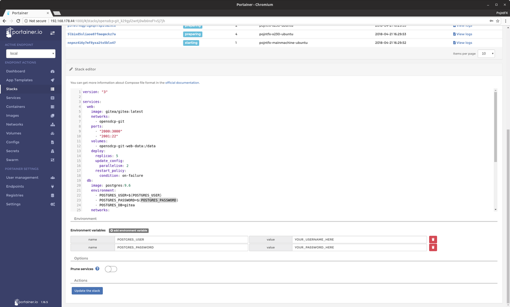
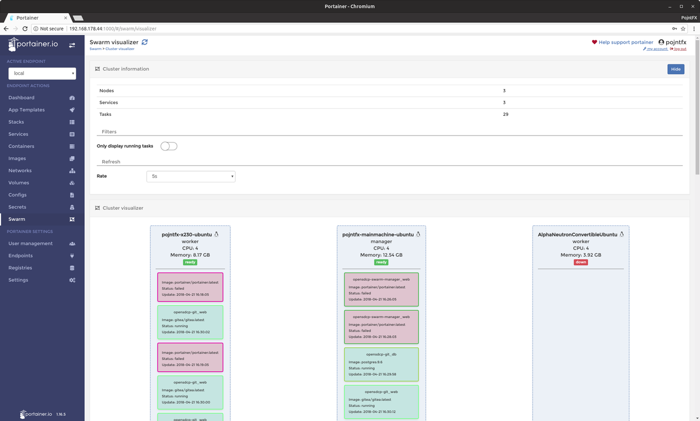

# OpenSDCP Swarm Manager

Portainer service configuration for the OpenSDCP project.

> Consider reading the [infrastructure overview](https://github.com/opensdcp/opensdcp-infrastructure#overview) before continuing.

## Demo

Visit [cpanel.opensdcp.org](https://cpanel.opensdcp.org/) and take a look at our instance (you can not login however, obviously).

## Usage

### Preparation

```bash
# Install dependencies (Ubuntu and Debian)
sudo apt install docker.io docker-compose
```

### Startup

```bash
# Serve development version on http://YOUR_IP:1100
docker-compose -f opensdcp-swarm-manager-dev.yml up
# ALTERNATIVE: Serve production version on http://YOUR_IP:1000
docker-compose -f opensdcp-swarm-manager-prod.yml up
```

### Setup

Visit `http://YOUR_IP:YOUR_PORT_FROM_ABOVE` and create the admin user. In case a login field appears but you've not yet set up an account, clear the browser's cache and reload. Select the "Local" environment and try it out!

> If you chose the development version, all the data will be saved in `./opensdcp-swarm-manager-web-data-dev/` in case you want to create backups. If you used the production version, it will be saved in the `opensdcp-swarm-manager-web-data` docker volume.

## Screenshots





## Documentation

Visit the [official Portainer documentation](https://portainer.readthedocs.io) to learn more about Gitea.

## Deployment

```bash
# Deploy production version to your docker swarm on http://YOUR_IP:1000
docker stack deploy -c opensdcp-swarm-manager-prod.yml opensdcp-swarm-manager
```

## License

OpenSDCP Portainer Service Configuration (C) 2018 Felix Pojtinger

This program is free software: you can redistribute it and/or modify
it under the terms of the GNU General Public License as published by
the Free Software Foundation, either version 3 of the License, or
(at your option) any later version.

This program is distributed in the hope that it will be useful,
but WITHOUT ANY WARRANTY; without even the implied warranty of
MERCHANTABILITY or FITNESS FOR A PARTICULAR PURPOSE. See the
GNU General Public License for more details.

You should have received a copy of the GNU General Public License
along with this program. If not, see <http://www.gnu.org/licenses/>.
