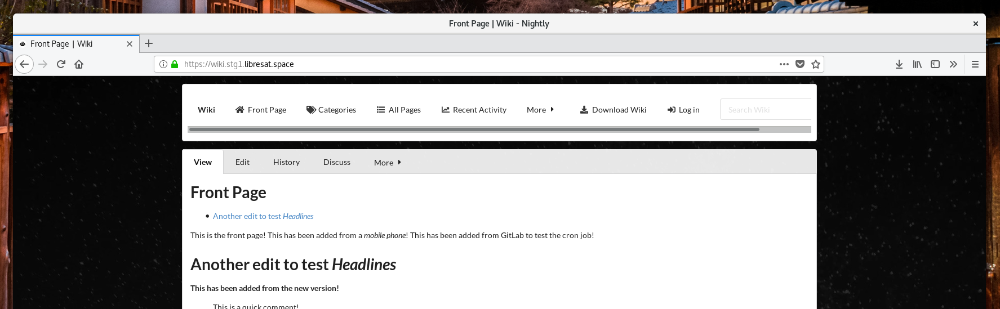
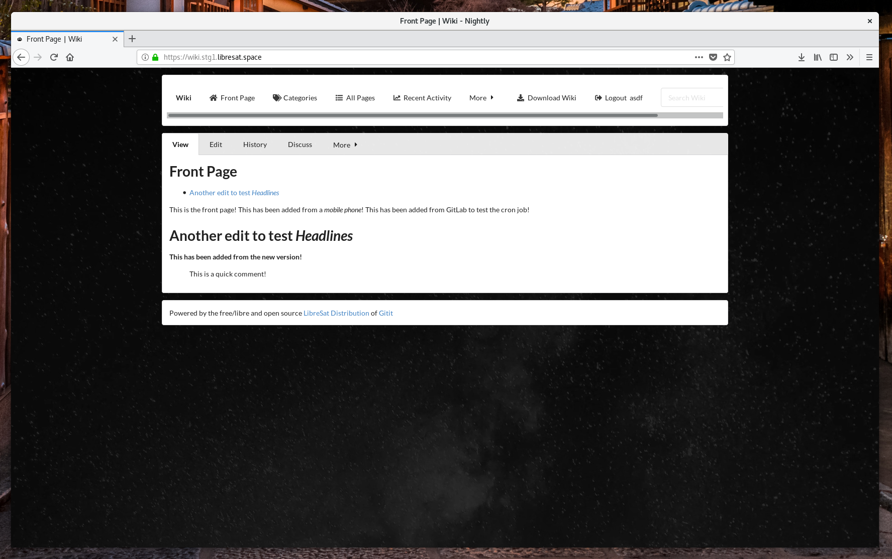
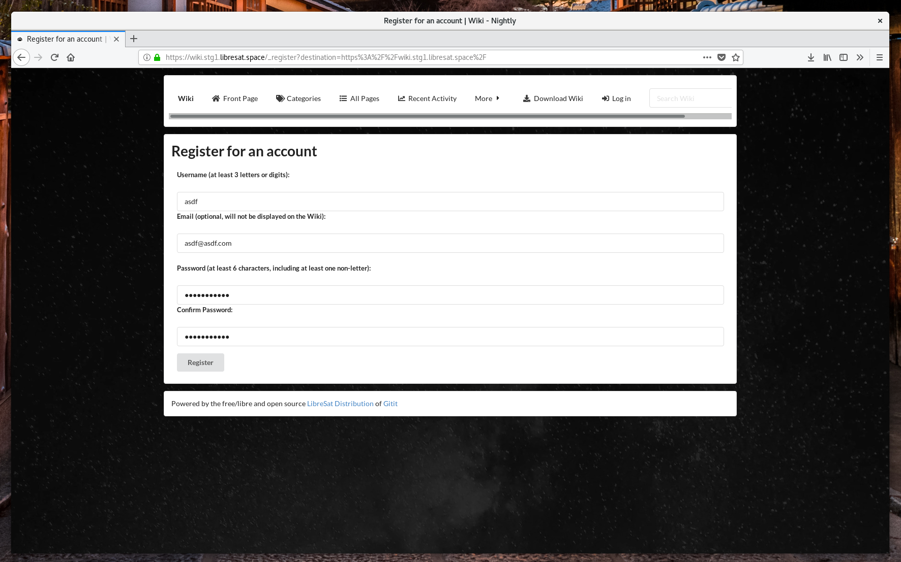
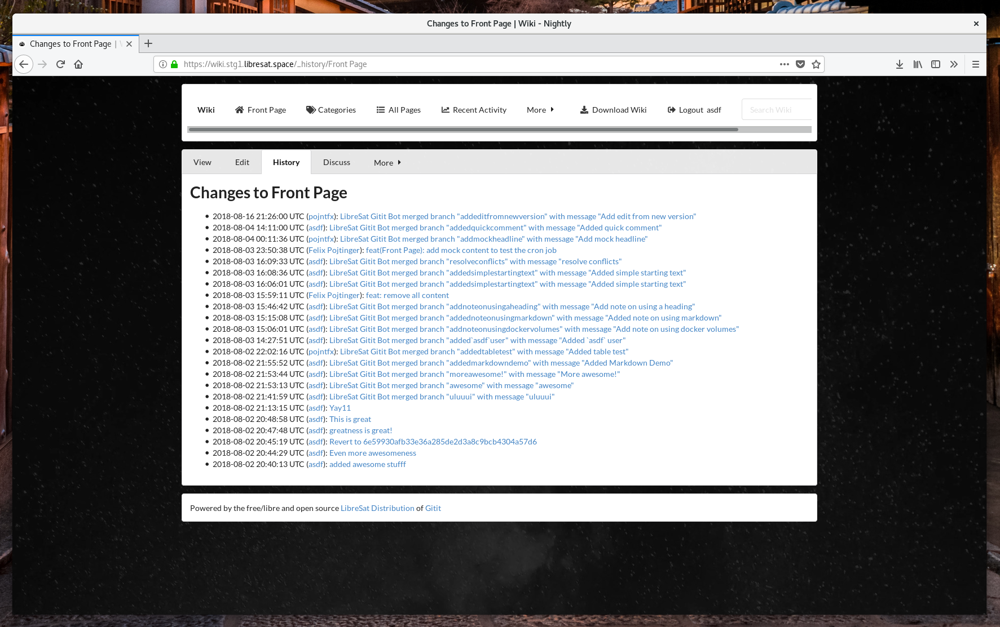
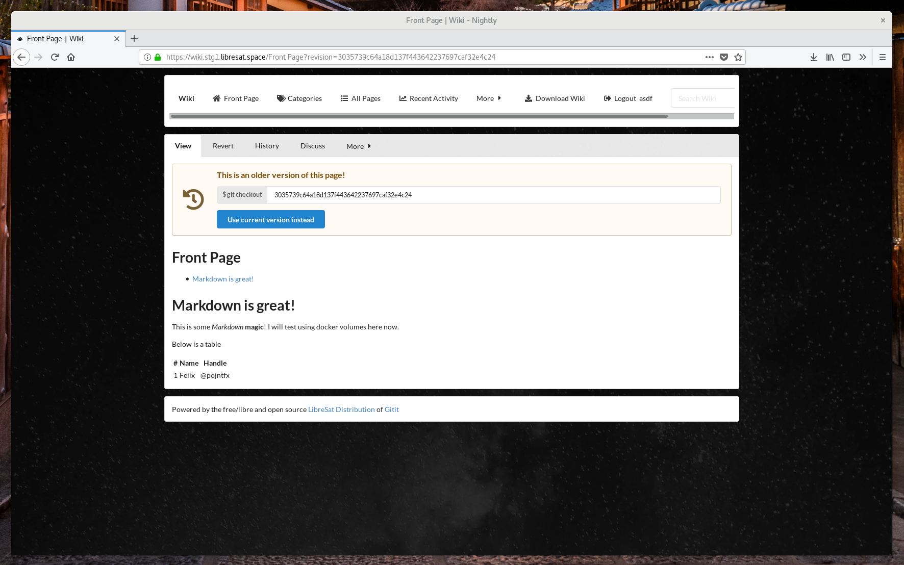
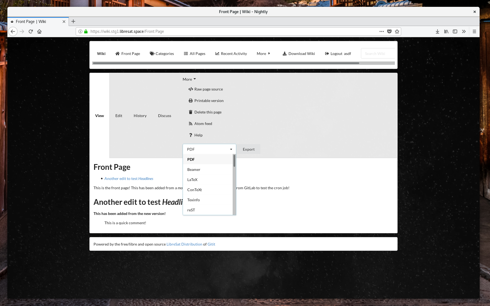
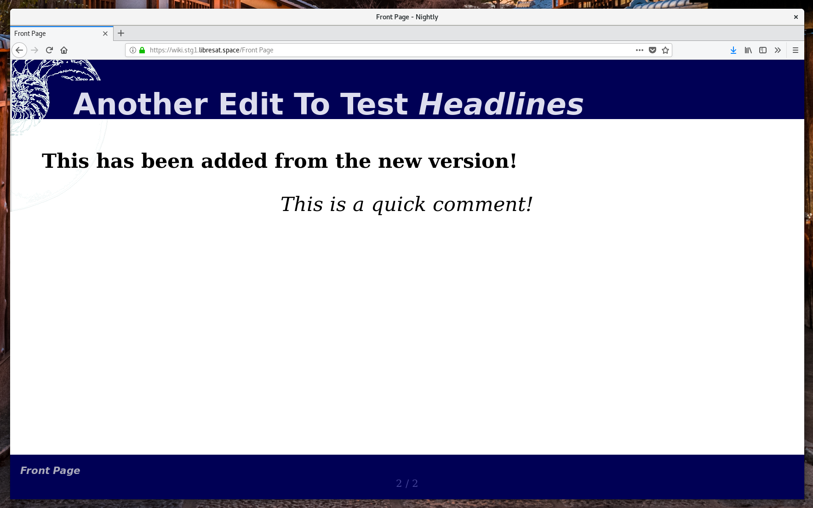

# LibreSat Wiki

The [LibreSat](https://libresat.space/) distribution of [Gitit](https://github.com/jgm/gitit).



[](https://wiki.libresat.space)
[](https://www.gnu.org/licenses/agpl-3.0.en.html)
[](https://creativecommons.org/licenses/by-sa/4.0/)
[](https://gitlab.com/libresat/libresat)
[](https://libresat.space/docs/infrastructure)

## Usage

```bash
# Install dependencies
npm install
# Build assets
npm run add-semantic
# Build and serve on http://localhost:5001
cd src/assets && gitit -f gitit.conf
```

## Deployment

First, set the SSH key for the git bot:

```bash
ssh-keygen -t rsa -N "" -f "src/assets/ssh/id_rsa_container"
# Reads your public SSH key and overwrites the contents of assets/id_rsa.pub with it, so that the bot can clone the wikidata repo
echo $(<~/.ssh/id_rsa.pub) > src/assets/ssh/id_rsa_repo_access.pub
```

Then, create the git bot account and remote git repository:

1.  Create account on [GitLab](https://gitlab.com) or other host
2.  Create git repo on host and give the bot account access to it (on GitLab, the "Maintainer" role permission is the right one)
3.  Add a file called "LICENSE.md" with a free (as in freedom) license in it (see [https://choosealicense.com/non-software/](https://choosealicense.com/non-software/)) to the repo. The repo must not be empty.
4.  Open up the SSH keys settings page of the bot account (on GitLab, that's [https://gitlab.com/profile/keys](https://gitlab.com/profile/keys)). We'll have to paste in the public SSH key of the bot later on

Furthermore, link to the remote git repository:

```bash
echo "git@gitlab.com:pojntfx/git-wikidata-test.git" \
> src/assets/templates/sshgitlink.st
echo "https://gitlab.com/pojntfx/git-wikidata-test" \
> src/assets/templates/httpsgitlink.st
echo "https://gitlab.com/pojntfx/git-wikidata-test/-/archive/master/git-wikidata-test-master.zip" \
> src/assets/templates/ziplink.st
```

Lastly, edit [src/chart/values.yaml](src/chart/values.yaml) according to your needs to finish the configuration. If you want even more configuration options, consider editing [src/assets/gitit.conf](src/assets/gitit.conf).

To deploy the wiki, run the following:

```bash
# Build assets
npm run add-semantic
# Build image
docker build src/ -t libresat-wiki
# Deploy to Kubernetes
helm install --values src/chart/values.yaml src/chart
```

## Screenshots

















